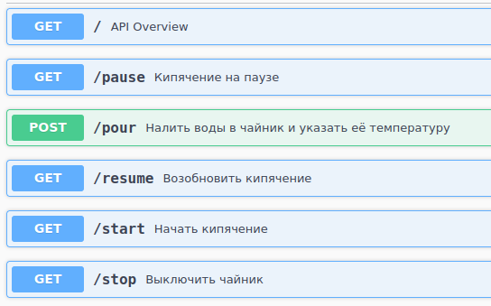
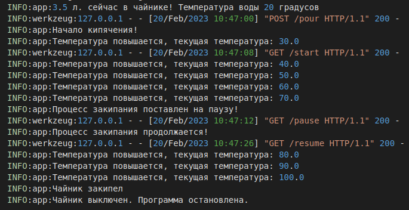
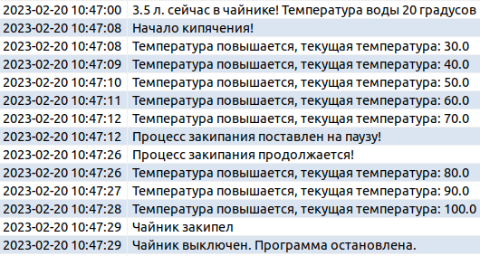

# Flask_kettle

#### Данный проект представляет собой имитацию работы чайника на базе фреймворка Flask.
___
## Возможности
1. Изменить конфигурацию для конкретного чайника;
2. Залить воду в чайник, указать ее начальную температуру;
3. Начать кипячение;
4. Поставить процесс кипячения на паузу;
5. Возобновить процесс кипячения;
6. Выключить чайник.
___
## Обзор API



## Пример логирования в файл:



## Пример добавления изменения статуса в БД:



___

## Установка
#### Перейдите в директорию проекта: 

```bash
cd flask_kettle/
```

#### Измените параметры чайника при неободимости:

```bash
config.json
```

#### Запустите скрипт:

```bash
python app.py
```
___

#### Приступайте к использованию!
___

